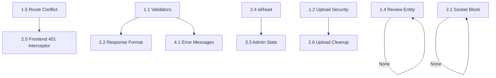

# PLAN: Audit & Fix — Rental Platform

> **Ngày tạo:** 2026-03-19
> **Mục tiêu:** Khám phá toàn bộ dự án, tìm bug/lỗi, chức năng chưa hoàn thiện, lên kế hoạch sửa chữa.
> **Project Type:** WEB (Node.js Backend + React Frontend)

---

## 📋 Overview

Dự án **Rental Platform** là một nền tảng cho thuê phòng trọ gồm 3 role:
- **Customer** (khách hàng): Tìm phòng, đặt lịch xem phòng, chat, review, favorite, báo cáo vi phạm
- **Landlord** (chủ trọ): Quản lý phòng, quản lý lịch hẹn, trả lời review, chat
- **Admin**: Quản lý user, xử lý báo cáo vi phạm, quản lý phòng

**Tech Stack:**
- Backend: Node.js + Express 5 + Sequelize (MySQL) + Socket.IO
- Frontend: React 19 + Vite 8 + React Router 7 + Axios + Socket.IO Client

---

## 🔍 KẾT QUẢ KHÁM PHÁ (Survey Results)

### 🔴 CRITICAL BUGS — Lỗi nghiêm trọng cần sửa ngay

| # | Vấn đề | File | Mức độ |
|---|--------|------|--------|
| C1 | **Validators rỗng — không validate dữ liệu đầu vào** | `validators/*.js` | 🔴 CRITICAL |
| C2 | **Upload không lọc file type** — cho upload bất cứ file gì (exe, zip...) | `utils/upload.js` | 🔴 CRITICAL |
| C3 | **JWT token không có expiry check phía socket** — socket chỉ verify nhưng expired token vẫn pass | `socket.js` | 🔴 CRITICAL |
| C4 | **Thiếu rate limiting** — API dễ bị brute force/DDoS | `app.js` | 🔴 CRITICAL |
| C5 | **`sequelize.sync({ alter: true })` chạy production** — có thể destructive với data | `server.js` | 🔴 CRITICAL |
| C6 | **CORS hardcode single origin** — không hỗ trợ deploy nhiều domain | `app.js`, `server.js` | 🟡 HIGH |
| C7 | **API response không consistent** — `validate.js` trả `{ message }` nhưng `errorHandler` trả `{ success, message }` | `middleware/validate.js` | 🟡 HIGH |

### 🟡 HIGH — Bug logic & chức năng chưa đúng

| # | Vấn đề | File | Chi tiết |
|---|--------|------|----------|
| H1 | **Đường dẫn xung đột DELETE `/api/rooms/:id`** — cả landlord và admin đều register cùng route | `landlord/roomController.js` L105, `admin/roomController.js` L82 | Express 5 sẽ dùng route đăng ký sau (admin), landlord delete sẽ dùng logic admin |
| H2 | **Review entity thiếu `landlordReply` field** | `entities/review.js` | Service `replyToReview` update `landlordReply` nhưng entity không define column này |
| H3 | **Socket `chat:send` bypass block check** — gửi tin nhắn qua socket không kiểm tra block | `socket.js` | Chỉ HTTP endpoint kiểm tra block, socket event thì bỏ qua |
| H4 | **`getActiveListingsCount` dùng `findAll` rồi `.length`** — nên dùng `COUNT()` | `admin/roomService.js` | Query không hiệu quả, tải toàn bộ rooms vào memory |
| H5 | **`listRooms` keyword search tải toàn bộ rooms** | `roomService.js` L159-178 | Khi có keyword, load ALL active rooms rồi filter in-memory — chậm dần khi data lớn |
| H6 | **Message `isRead` field không bao giờ được update** | Toàn hệ thống | Entity có `isRead` nhưng không có API/logic nào cập nhật trạng thái đã đọc |
| H7 | **Landlord chat (MessagesPage) là trang riêng** nhưng Customer chat cũng dùng ChatPage — chức năng giống nhưng code khác | Pages | Tiềm ẩn bug do logic trùng lặp |
| H8 | **Appointment có `phone` field** nhưng không validate định dạng phone | `appointmentService.js` | Phone từ body được lưu trực tiếp không sanitize |
| H9 | **Upload files không cleanup khi transaction fail** | `roomService.js`, `upload.js` | Files đã ghi vào disk nhưng nếu DB insert fail, files trở thành rác |

### 🟠 MEDIUM — Thiếu sót chức năng

| # | Vấn đề | File | Chi tiết |
|---|--------|------|----------|
| M1 | **Không có chức năng Change Password** | Auth | Chỉ có update profile (fullName, email, phone, area) |
| M2 | **Không có Forgot Password / Reset Password** | Auth | Thiếu hoàn toàn |
| M3 | **Không có notification (thông báo)** | Toàn hệ thống | Khi có appointment mới, review mới, tin nhắn mới — không thông báo |
| M4 | **Admin Dashboard thiếu thống kê tổng quan** | `AdminDashboardPage.jsx` | Chỉ có `activeRoomsCount`, thiếu: tổng users, tổng appointments, revenue trends |
| M5 | **Không có pagination cho Admin Users, Admin Reports** | Admin pages | Load toàn bộ data, không phân trang |
| M6 | **Không có search/filter cho Admin Users** | `ManageUsersPage.jsx` | Không thể tìm kiếm user theo tên/email/role |
| M7 | **Landlord Dashboard thiếu overview metrics** | `LandlordDashboardPage.jsx` | Thiếu: tổng views phòng, tỉ lệ lịch hẹn được duyệt |
| M8 | **Room không có trạng thái "rented"** usable — có trong ENUM nhưng không có UI để set | `room.js`, Frontend | Status `rented` tồn tại nhưng không có flow |
| M9 | **Không có image compression/resize** | `upload.js` | Upload ảnh gốc full-size, tốn storage và bandwidth |
| M10 | **Thiếu API response interceptor xử lý 401** | `api/client.js` | Khi token expired, không auto-logout hoặc refresh |
| M11 | **Seeders thiếu hoặc incomplete** | `scripts/seed.js` | Cần kiểm tra seeder tạo dữ liệu mẫu |
| M12 | **Không có logging hệ thống** | Backend | Chỉ có `morgan` cho HTTP logs, không log errors vào file |

### 🔵 LOW — Cải thiện chất lượng code & UX

| # | Vấn đề | File | Chi tiết |
|---|--------|------|----------|
| L1 | **Inconsistent language** trong error messages | Backend services | Mix tiếng Việt và tiếng Anh: "Vui lòng nhập email" vs "Missing required fields" |
| L2 | **Validators tồn tại nhưng không được sử dụng** | Controllers | `validate()` middleware không được apply vào bất cứ route nào |
| L3 | **Không có input sanitization / XSS protection** | Backend | Nội dung review, chat, description không sanitize HTML |
| L4 | **`docs/` chứa HTML mockup cũ** không liên quan đến React app | `docs/*.html` | 14 file HTML tĩnh cũ, nên dọn dẹp hoặc archive |
| L5 | **NotifyContext dùng Tailwind classes** nhưng dự án dùng vanilla CSS | `NotifyContext.jsx` | Tailwind classes sẽ không render nếu không có Tailwind trong project |
| L6 | **Thiếu SEO meta tags** | `index.html` | Thiếu description, og:tags cho sharing |
| L7 | **Không có 404 page** | `App.jsx` | Routes không match sẽ hiện blank |
| L8 | **Không có loading skeleton / empty states tốt** | Frontend pages | UX trống khi chưa có data |

---

## ✅ Success Criteria

1. ✅ Tất cả validators hoạt động đúng, validate input trước khi xử lý
2. ✅ Upload chỉ cho phép ảnh (jpg, png, webp, gif)
3. ✅ Không còn route conflict
4. ✅ Review entity có `landlordReply` column
5. ✅ Socket chat kiểm tra block status
6. ✅ API response format consistent
7. ✅ Có rate limiting cho auth endpoints
8. ✅ Message `isRead` hoạt động
9. ✅ Error messages consistent (chọn 1 ngôn ngữ)
10. ✅ Có 401 interceptor ở frontend
11. ✅ Có 404 page

---

## 📋 Task Breakdown

### Phase 1: 🔴 Critical Security & Bug Fixes (P0)

#### Task 1.1: Implement Input Validators
- **Agent:** `backend-specialist`
- **Skill:** `api-patterns`, `clean-code`
- **Priority:** P0 — CRITICAL
- **INPUT:** Empty validators (`authValidator.js`, `roomValidator.js`, `appointmentValidator.js`, `reviewValidator.js`)
- **OUTPUT:** Fully implemented validators with proper field validation
- **VERIFY:** Send invalid data → receive 400 with clear error message
- **Details:**
  - [ ] `authValidator`: validate email format, password min 6 chars, fullName required
  - [ ] `roomValidator`: validate title, price (number > 0), area, address required
  - [ ] `appointmentValidator`: validate scheduledAt (future date), phone format
  - [ ] `reviewValidator`: validate rating (1-5), content max length
  - [ ] Apply `validate()` middleware to all corresponding routes

#### Task 1.2: Secure File Upload
- **Agent:** `backend-specialist`
- **Skill:** `vulnerability-scanner`
- **Priority:** P0 — CRITICAL
- **INPUT:** `utils/upload.js` (no file type filter)
- **OUTPUT:** Upload với file filter cho phép chỉ ảnh
- **VERIFY:** Upload `.exe` file → rejected. Upload `.jpg` → accepted.
- **Details:**
  - [ ] Add `fileFilter` cho multer: chỉ cho phép `image/jpeg`, `image/png`, `image/webp`, `image/gif`
  - [ ] Validate file extension + MIME type

#### Task 1.3: Add Rate Limiting
- **Agent:** `backend-specialist`
- **Skill:** `api-patterns`
- **Priority:** P0 — CRITICAL
- **INPUT:** `app.js` (no rate limiting)
- **OUTPUT:** Rate limiter cho auth endpoints + global limiter
- **VERIFY:** Gửi > 10 request login/min → bị block
- **Details:**
  - [ ] Install `express-rate-limit`
  - [ ] Auth endpoints: 10 requests/15 min
  - [ ] Global: 100 requests/15 min

#### Task 1.4: Fix Review Entity — Add `landlordReply` Column
- **Agent:** `backend-specialist`
- **Skill:** `database-design`
- **Priority:** P0 — BUG
- **INPUT:** `entities/review.js` (thiếu `landlordReply` field)
- **OUTPUT:** Review entity với `landlordReply` TEXT field
- **VERIFY:** Landlord reply to review → `landlordReply` saved correctly
- **Details:**
  - [ ] Add `landlordReply: { type: DataTypes.TEXT, allowNull: true }` to review entity

#### Task 1.5: Fix Route Conflict — DELETE `/api/rooms/:id`
- **Agent:** `backend-specialist`
- **Skill:** `api-patterns`
- **Priority:** P0 — BUG
- **INPUT:** Cả `landlord/roomController` và `admin/roomController` register cùng `DELETE /api/rooms/:id`
- **OUTPUT:** Phân tách rõ ràng: landlord delete qua `/api/landlord/rooms/:id`, admin qua `/api/admin/rooms/:id`
- **VERIFY:** Landlord và Admin delete hoạt động đúng, không conflict
- **Details:**
  - [ ] Di chuyển landlord DELETE sang `/api/landlord/rooms/:id`
  - [ ] Admin DELETE giữ `/api/admin/rooms/:id`
  - [ ] Update frontend `LandlordService.deleteRoom()` và `AdminService.deleteRoom()` tương ứng

#### Task 1.6: Fix `sequelize.sync` for Production
- **Agent:** `backend-specialist`
- **Skill:** `database-design`
- **Priority:** P0 — CRITICAL
- **INPUT:** `server.js` dùng `sync({ alter: true })` luôn
- **OUTPUT:** Chỉ sync khi dev, production dùng migration
- **VERIFY:** `NODE_ENV=production` → không chạy sync
- **Details:**
  - [ ] Default `DB_SYNC=false` khi production
  - [ ] Thêm warning log khi sync với alter=true

---

### Phase 2: 🟡 Bug Fixes & Logic Improvements (P1)

#### Task 2.1: Fix Socket Chat — Block Check
- **Agent:** `backend-specialist`
- **Skill:** `api-patterns`
- **Priority:** P1
- **INPUT:** `socket.js` không check block khi gửi tin nhắn
- **OUTPUT:** Socket `chat:send` kiểm tra block trước khi create message
- **VERIFY:** Blocked user gửi tin qua socket → nhận `chat:error`
- **Details:**
  - [ ] Import UserBlock entity
  - [ ] Check block relationship before creating message
  - [ ] Emit `chat:error` nếu bị block

#### Task 2.2: Fix Inconsistent API Response Format
- **Agent:** `backend-specialist`
- **Skill:** `api-patterns`
- **Priority:** P1
- **INPUT:** `validate.js` trả `{ message }` thay vì `{ success: false, message }`
- **OUTPUT:** Consistent response format với `{ success, message }`
- **VERIFY:** Validation error response có `success: false`
- **Details:**
  - [ ] Update `validate.js` trả về `{ success: false, message }` khi validation fail

#### Task 2.3: Optimize Admin Count Query
- **Agent:** `backend-specialist`
- **Skill:** `database-design`
- **Priority:** P1
- **INPUT:** `admin/roomService.js` dùng `findAll()` + `.length` để đếm
- **OUTPUT:** Dùng `count()` query SQL
- **VERIFY:** Performance cải thiện, query log chỉ có `SELECT COUNT(*)`

#### Task 2.4: Implement Message `isRead` Status
- **Agent:** `backend-specialist` + `frontend-specialist`
- **Skill:** `api-patterns`
- **Priority:** P1
- **INPUT:** `isRead` tồn tại trên entity nhưng không có logic
- **OUTPUT:** API + UI cập nhật `isRead` khi mở conversation
- **VERIFY:** Mở conversation → messages marked as read. Inbox hiển thị unread count.
- **Details:**
  - [ ] Backend: Thêm endpoint `PATCH /api/chat/read/:peerId` to mark messages as read
  - [ ] Backend: Cập nhật `getInbox` trả về `unreadCount`
  - [ ] Frontend: Gọi mark-read khi mở conversation
  - [ ] Frontend: Hiển thị badge unread count trong inbox

#### Task 2.5: Add 401 Response Interceptor
- **Agent:** `frontend-specialist`
- **Skill:** `react-best-practices`
- **Priority:** P1
- **INPUT:** `api/client.js` không xử lý 401
- **OUTPUT:** Auto-logout + redirect khi token expired
- **VERIFY:** Expired token → user bị logout, redirect to login
- **Details:**
  - [ ] Add response interceptor xử lý 401
  - [ ] Clear token + redirect to `/login`

#### Task 2.6: Fix Upload Cleanup on Transaction Failure
- **Agent:** `backend-specialist`
- **Skill:** `clean-code`
- **Priority:** P1
- **INPUT:** Files upload trước khi DB transaction, nếu fail thì files thành rác
- **OUTPUT:** Cleanup uploaded files khi transaction rollback
- **VERIFY:** Force DB error → uploaded files bị xóa
- **Details:**
  - [ ] Track uploaded filenames trong transaction
  - [ ] On rollback: delete uploaded files from disk

---

### Phase 3: 🟠 Missing Features (P2)

#### Task 3.1: Add Change Password
- **Agent:** `backend-specialist` + `frontend-specialist`
- **Priority:** P2
- **INPUT:** Không có change password
- **OUTPUT:** API + UI cho change password
- **VERIFY:** Đổi mật khẩu → login lại với mật khẩu mới thành công
- **Details:**
  - [ ] Backend: `PATCH /api/auth/password` — require currentPassword + newPassword
  - [ ] Frontend: Form change password trong ProfilePage

#### Task 3.2: Add 404 Not Found Page
- **Agent:** `frontend-specialist`
- **Priority:** P2
- **INPUT:** Không có 404 route
- **OUTPUT:** Trang 404 với nút quay về trang chủ
- **VERIFY:** Navigate to `/xyz-random` → hiển thị 404 page
- **Details:**
  - [ ] Tạo `NotFoundPage.jsx`
  - [ ] Thêm `<Route path="*" element={<NotFoundPage />} />` vào App.jsx

#### Task 3.3: Admin Dashboard Statistics
- **Agent:** `backend-specialist` + `frontend-specialist`
- **Priority:** P2
- **INPUT:** Dashboard chỉ có `activeRoomsCount`
- **OUTPUT:** Thêm: tổng users, tổng appointments (pending/approved), tổng reports (pending)
- **VERIFY:** Dashboard hiển thị đầy đủ thống kê

#### Task 3.4: Admin User Search & Pagination
- **Agent:** `backend-specialist` + `frontend-specialist`
- **Priority:** P2
- **INPUT:** Admin Users page load all, không search/paginate
- **OUTPUT:** Search by name/email, filter by role, pagination
- **VERIFY:** Search "landlord" → chỉ hiện landlord users

#### Task 3.5: Add "Rented" Status Flow
- **Agent:** `backend-specialist` + `frontend-specialist`
- **Priority:** P2
- **INPUT:** Status "rented" tồn tại nhưng không có UI flow
- **OUTPUT:** Landlord có thể đánh dấu phòng "đã cho thuê" + Customer thấy badge
- **VERIFY:** Landlord mark rented → Room hiển thị "Đã cho thuê" cho customer

---

### Phase 4: 🔵 Code Quality & UX (P3)

#### Task 4.1: Standardize Error Messages
- **Agent:** `backend-specialist`
- **Priority:** P3
- **INPUT:** Mix tiếng Việt và tiếng Anh
- **OUTPUT:** Chọn 1 ngôn ngữ (tiếng Việt cho user-facing, English cho system)
- **VERIFY:** Tất cả error messages consistent

#### Task 4.2: Add XSS Protection / Input Sanitization
- **Agent:** `backend-specialist` + `security-auditor`
- **Priority:** P3
- **INPUT:** Không sanitize HTML trong review content, chat, description
- **OUTPUT:** Sanitize input trước khi save
- **VERIFY:** Gửi `<script>alert(1)</script>` → bị escape

#### Task 4.3: Fix NotifyContext Tailwind Classes
- **Agent:** `frontend-specialist`
- **Priority:** P3
- **INPUT:** NotifyContext dùng Tailwind classes nhưng dự án không cài Tailwind
- **OUTPUT:** Chuyển sang vanilla CSS hoặc cài Tailwind
- **VERIFY:** Notification toast hiển thị đúng styling

#### Task 4.4: Add SEO Meta Tags
- **Agent:** `frontend-specialist`
- **Skill:** `seo-fundamentals`
- **Priority:** P3
- **INPUT:** `index.html` thiếu SEO tags
- **OUTPUT:** Thêm description, og:tags
- **VERIFY:** Share link → hiển thị preview đúng

#### Task 4.5: Clean Up Legacy HTML Files
- **Agent:** N/A (Manual)
- **Priority:** P3
- **INPUT:** `docs/` folder chứa 14 HTML mockup cũ + screenshots
- **OUTPUT:** Archive hoặc di chuyển ra khỏi main code
- **VERIFY:** Folder docs/ chỉ chứa documentation cần thiết

---

## 🔢 Implementation Priority Order

```
Phase 1 (CRITICAL) → ưu tiên nhất, sửa trước khi deploy
  ├── Task 1.1: Validators
  ├── Task 1.2: File upload security
  ├── Task 1.3: Rate limiting
  ├── Task 1.4: Review landlordReply column
  ├── Task 1.5: Route conflict
  └── Task 1.6: sequelize.sync production

Phase 2 (HIGH) → sửa sau Phase 1
  ├── Task 2.1: Socket block check
  ├── Task 2.2: Response format
  ├── Task 2.3: Count query optimization
  ├── Task 2.4: isRead implementation
  ├── Task 2.5: 401 interceptor
  └── Task 2.6: Upload cleanup

Phase 3 (MEDIUM) → tính năng mới
  ├── Task 3.1: Change password
  ├── Task 3.2: 404 page
  ├── Task 3.3: Admin statistics
  ├── Task 3.4: Admin search/pagination
  └── Task 3.5: Rented status flow

Phase 4 (LOW) → polish
  ├── Task 4.1: Error messages
  ├── Task 4.2: XSS protection
  ├── Task 4.3: NotifyContext CSS
  ├── Task 4.4: SEO meta tags
  └── Task 4.5: Clean legacy files
```

---

## 🔗 Task Dependencies



---

## Phase X: Verification Checklist

- [ ] Run `npm run lint` — No errors
- [ ] Run `npm run build` — Build success (frontend)
- [ ] All validators applied and tested
- [ ] Upload security tested with non-image files
- [ ] Route conflict resolved — API responds correctly
- [ ] Review `landlordReply` field persists in DB
- [ ] Socket chat respects block status
- [ ] `isRead` updates correctly
- [ ] 401 interceptor redirects properly
- [ ] 404 page renders for unknown routes
- [ ] API response format consistent across all endpoints
- [ ] No Tailwind class issues in notification component
